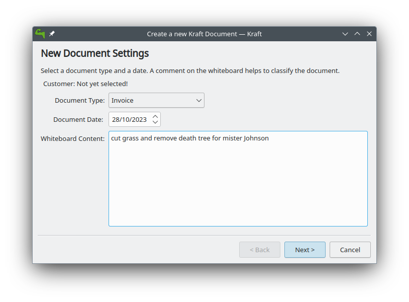
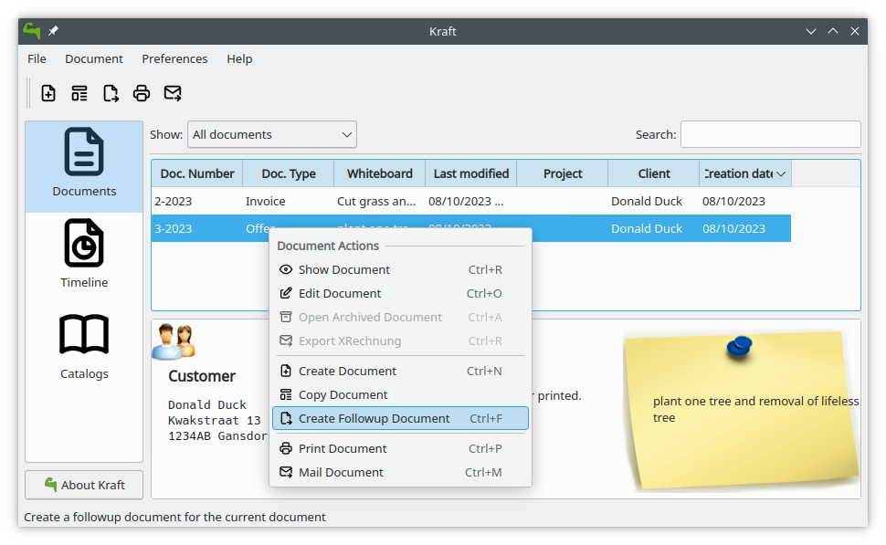

= The Kraft Handbook
Ronald Stroethoff, Klaas Freitag
:toc: left
:doctype: article

:author: Ronald Stroethoff
:email: <stroet43@zonnet.nl>
:description: Kraft is a Qt program for organizing documents like quotes and invoices in a small business.
:keywords: Qt;office;bookkeeping
:experimental:
:imagesdir: images/


include::locale/attributes.adoc[]

== Introduction

Kraft is a Qt and KDE application to organize office documents like quotes and invoices in a small business. It eases the creation of documents and helps with repeating tasks.

Using Kraft, there is no need for fiddling with a text processor any more. Documents are created by a few clicks, edited, generated and archived automatically. Kraft generates high quality PDF output for printing, mailing and archiving.

Feature Overview::

* Simple creation of offers, invoices and similar documents.
* Customer management, deeply integrated with the mature KDE KAddressbook.
* Maintenance of document relations, ie. Partial invoices vs. invoices.
* Templates for document header- and footertexts and for document items.
* Pre calculation of item prices.
* Material management.
* Configurable document creation in PDF format for print and email.

The code of Kraft is open source and is released under the https://en.wikipedia.org/wiki/GNU_General_Public_License[GNU General Public License].

NOTE: Kraft is driven by community of users, coders, artists and others by voluntary work. +
Also this manual needs contributions! +
 +
 Learn more on https://github.com/dragotin/kraft/blob/master/manual/Readme.md[how to contribute]!


== First Use and Basic Configuration

When Kraft is started for the first time, it automatically enters the initial setup process.

During the initial setup you are asked to select a database to use and give the name and address of your company.

You can fill in your company address (that appears on the printed documents) in two ways: in the setup procedure use the first tab *Select from Addressbook* for to select your on address in KAddressBook (if you have filled your own address in KaddressBook) or use the second tab *Manual entry* for to fill in the information of the address from your company manually. This step is necessary for the correct generation of your documents as the address is automatically used in the document generation step.

image:company_adress1_EN.png[Company adress,float="right"]

After the initial setup, select menu:Preferences[Settings].
That allows to prepare Kraft correctly so it can be used in a proper way.

In the Preferences dialog we have the tabs:

 *Document Defaults
 *Taxes
 *Documunt Types
 *Wages
 *Units
 *Own identity

Each of the tabs allows to enter useful values for the specific use case.

=== Document Types

At the first use you find a list of different document types, such as:

* Acceptance of order
* Delivery receipt
* Invoice
* Offer

image:documentype_EN.png[Document type,float="right"]

Translate this types to your own language.
You can also add new ones and remove document types you wont use.

==== Numbercycles

image:numbercycles_EN.png[Numbercycles,float="right"]
Each document has to have an unique identifier that identifies the document. There must not be two documents in Kraft with the same identifier.

The format of the identifier is configuratable in Kraft. For that, Kraft has a concept of so called number cycles.
Number cycles are used to define the form of the *document number* which is printed on every document.

All documents of a certain type have identifiers taken out of one number cycle. Each document type has a number cycle assigned. Different document types can use the same number cycle to generate ids from. That way, for example the document types Invoice and Final Invoice can use numbers from the same number cycle, even thought they are different document types in Kraft.
Number cycles are identified by their name.
User can create new number cycles and edit them clicking on the button btn:[Edit Number Cycles...]

The format of the document numbers are defined by a template that can contain normal, fixed characters and also some variables that are replaced by the respective values when the document is created.

Each identifier needs to be unique, and thus has to contain a counter. Kraft supports two types of counter: One (variable `%i`) is incremented globally for every new document. The other (variable `%n`) is reset every day and starts at 1 again on every new day.
In addition to the counter, more information can be added to the template form an useful number. Examples are a constant text or parts of the date.

The default numbercycle delivered with Kraft contains the year, the month and a serialnumber. That way you can compare offers or orders from last year with this year or the month April of last year with the month April of this year and get on this way an impression from the results of your business.

See the following table for available variables which can be used:

|===

| `%y` or `%yyyy`  | the year of the document date.
| `%yy`            | the year of the document (two digits).
| `%w`             | the week number of the document date.
| `%ww`            | the week number of the document date with leading zero.
| `%d`             | the day number of the document date.
| `%dd`            | the day number of the document date with leading zero.
| `%m` or `%M`     | the month number of the document date.
| `%MM`            | the month number with leading zero.
| `%c`             | the customer id from kaddressbook
| `%type`          | the localised doc type (offer, invoice etc.)
| `%uid`           | the contact id of the client.
| `%i` .. `%iiiiii`| the unique counter
| `%n` .. `%nnnnnn`| the unique day counter (combine with date)

|===

A number cycle template needs to contain either `%i` or `%n`, if not, `%i` is appended automatically.

Both `%i` and `%n` are numeric values. They can also be padded with with leading zeros. The length is defined by the number of i's or n's put into the template. For example, if a daily counter with length of three and leading zeros is desired, `%nnn` has to be put into the template. This works up to a length of six characters.
____
NOTE:
The "design" of the numbercycles and document numbers is very important. With the flexible system of templating Kraft can not prevent invalid number cycles. It is in the responsibility of the user.
____


=== Taxes

image:taxes_EN.png[Taxes,float="right"]
In many countries there are two kinds of VAT-taxes for sold products.

A high level and
a low level.

Fill here the appropriate amounts in for the high level and the low level.
If the tax-level is changing, then you add here the start date with the new tax-levels.

=== Wages

image:wages_EN.png[Wages,float="right"]
A list of wage costs is maintained in Kraft. The items are used in
templates and during calculation.

All data can be edited, customized and new items can be added in the
Kraft Configuration Dialog reachable through the Settings menu.

Remember that these units are later used in the documents, it is
therefor important that you translate them to your own language and to
fill in the correct prices.

=== Units of measurement

image:unity_EN.png[Units of measurement,float="right"]
A list of units of measurement is maintained in Kraft. In Kraft Configuration Dialog reachable through the Settings menu can you edit and customize items already in the
list, and also can you add new items to the list.

Remember that these units are later used in the documents, it is
therefor important that you translate them to your own language.

=== Own identity

Check here if the information that you have given during the initial
setup is correct for the use in the documents.

____
WARNING:
If you made the choice to use the information from KaddressBook then is
the information from a later manual entry ignored.
____

After we have made some corrections to the configuration, we go back to
the main window.Here we see three tabs:

* Documents
* Timeline
* Catalogs


== Catalogs

Kraft supports so called Catalogs in which templates for document items are kept. With the catalogs creating documents can be significantly accellerated in the day to day business. When creating new documents, the items templates from the catalogs can easily selected and moved over to the document.

Since templates are organized in chapters entire documents can be prepared in different chapters to be used as template documents.

Of course the items in the documents can be edited after they got picked from a catalog.

By default Kraft comes with two different catalogs:

`Material`

A catalog of material that are sold, with their purchase prices, the
profit and the sell-price.

and `Standard Templates`

A catalog of standard recipes of work like planting trees.

Both catalogs can have chapters and sub-chapters for to organize your
templates. First we are going to fill in the

=== Material Catalog

A catalog of material that are sold, with their purchase prices, the
profit and the sell-price. First we are going to add new chapters and
subchapters.

==== New chapters

Select with the mouse the column-name `material`, select now in the
context-menu [Add a sub chapter]

and add an extra chapter like `Trees`

==== New sub chapters

We are going to ad sub chapters in the map `Trees`. Select with the mouse
the name of the chapter where you like to add a subchapter, select now
in the context-menu [Add a sub chapter]
and ad an extra subchapters like `Loaf trees` and `needle trees`.
After adding the extra chapters and subchapters for dividing the
material, we are going to add the material themself.

==== New template

Select with the mouse the name of the sub-chapter or chapter where you
like to add a material.
Select the sub map Loaf trees and select now in the context-menu
[Add a template]

Add the extra materials `coconut tree`, `apple tree` and `pine-apple tree`.

Fill in the price that we have paid.

Fill in the profit that we want to have on the material

And fill in how much is in a packet.

image:catalog_material_EN.png[Material catalog,float="right"]
After this we add also in the map 'Wood' a item for a 'support pole' for later use with its price.

Now we are going to:

=== Standard Templates

This is a catalog of standard recipes of work like:

* planting trees
* cutting grass
* transport costs
* planting grass
* sowing grass-seed

We add here the standard work of planting a tree.

Select with the mouse the name of the chapter [Work] where you
like to add the new template,

select now the context-menu [New template]

and the extra templates `Plant tree` and `cut grass`.

After we made the new template, a window opens with 4 tabs:

* Template
* Time calculation
* Fix costs
* Material

First we go to the tab:

==== Template

We give here the name of the new standard template like `Plant tree`
image:catalog_standard_EN.png[Standard catalog,float="right"]
____
WARNING:
be careful, this name is later used in the invoice
____

we select that this is per piece and that the margin is 8% and that the
full VAT is applicable.

==== Time calculation

We fill here in a number of work with the time:

.Spent time
[cols=",,",]
|===
|Dig hole |32 min. |worker
|Place tree |12 min. |worker
|Fill hole |17 min. |worker
|give water |5 min. |worker
|===

The cost for worker which we have earlier filled in is now used.
image:catalog_standard_work_EN.png[Time calculation,float="right"]
____
NOTE:
in the invoice we see later only Plant tree, we will not see the parts
dig hole,place tree,fill hole,give water
____

Now we go to the tab

==== Fixed costs

and fill in:

.Fixed item
[cols=",,",]
|===
|Transportcost |35 euro |1 pcs.
|===

image:catalog_standard_fixed_cost_EN.png[Fixed cost,float="right"]

After this we go to the tab:

==== Material

Here we select btn:[next], after which the window [Add Material to Calculation] opens for a selection of material.
We navigate to the map 'wood' where we select the 'support pole'.

.Used materials
[cols=",,",]
|===
|1 |support pole |3,5 euro
|===

image:catalog_standard_material_EN.png[Material,float="right"]

We go now back to the first tab template

On the first tab [template], we can now see the overall cost per
one unit

Click on [OK] for saving the result or on [cancel] for discarding the
result.

We make a second template `cut grass`

we fill in `cut grass`, as unit we choose sm (square meter), on the second
tab we fill in that we need 3 min per square meter.

Click on [OK] for saving the result or on [Cancel] for discarding the
result.

We are now ready for the first invoice.

[[Invoice]]
== Creating Documents

=== The first Invoice

Open the tab btn:[documents]

Click on btn:[create document]

The window document [creation wizard opens].

Select in document type `invoice`.

Fill in on the whiteboard content a short text about what the invoice
is, like: `cut grass and planted tree for mister Jonson`

Click on btn:[next]

Select on the new window the name and address from the client.

(if the name and address is not there, click then on btn:[new contact] or on
btn:[edit contact] if you want to edit the contact)

Click on btn:[OK].

Now opens the window document [items].

this window has 2 tabs and the 3 buttons on the top:

* btn:[Add item...],
* btn:[Add discount item],
* btn:[Show templates].

In the left tab you can see all the items that we want to place on the
invoice, on the right tab we see the text from the header, the total
price and the footer.

If you click on the text of the header or the footer on the right side
then the window changes in such a way that you can edit the header or
the footer.

Adapt the header and the footer to your situation, on the footer you can
place a text: `We make your garden-dream come to reality.`.

Click on the button btn:[Show templates].

The right tab changes and show now the earlier made templates, we select
in the group Work, the subgroup Plant tree and click then on the button
with the to the left pointing arrow on the bottom side.

A new window [Create Item from Template] opens.

Because we have planted 2 trees, we go to the field [insert] and change
this to 2 pcs.

Click on btn:[OK] for saving the result or on btn:[cancel] for discarding the
result.

The window close and we go back to the main window.

We click again on btn:[Show templates] and select this time `cut grass`, we
click again on the button with the arrow, in the opened window we select
that the grass-field was 24 square meter.

Click on btn:[OK] for saving the result or on btn:[Cancel] for discarding the
result.

We add now manually an item by clicking on the button btn:[Add item…] and the window [create new item] opens.

Because we have delivered a special tree, we fill here in the name of
the special tree `liguster`, at the field insert we fill in the number
of the special trees that we have delivered and the price of them.

____
WARNING:
Remind that in the catalog we can add a profit on the price of the
material, in the invoice and in the offer we can not add a profit on the
price of the material.
____

We have now an invoice with 3 items.

Click on btn:[OK] for saving the invoice or on btn:[Cancel] for discarding the
invoice.

We click on btn:[OK] and save the result.

Your first invoice is now ready for sending.

In the window documents we see our first invoice, notice that this
document has a document number which we can see on the left side.

On top of the window with all the invoices we see the button [Print
Document], on which we click.

From the invoice will now a PDF be made which we can print on paper or
send by email to the client.

After this we are going to create a offer for some work in a garden.

[[Offer]]
=== Creating an Offer

The client has asked to plant a tree, we will offer 3 different trees which we can plant.

Beside this, we have seen that there is a lifeless three, which we will offer to remove as extra work.


For the total price we do not want to show the price of the removal of the lifeless tree and we want for the total price only to show the price of one tree and not three.

Open again the tab btn:[documents].

Click on btn:[create document]

The window _Document Creation Wizard_ opens.

select in btn:[document type] > btn:[Offer].

Fill in on the whiteboard content a short text about what the offer is,
like: `plant one tree and removal of lifeless tree`

Click on btn:[next]

Select on the new window the name and address from the client.

(if the name and address is not there, click then on btn:[new contact] or on
btn:[edit contact] if you want to edit the contact)

Click on btn:[OK].

Now the window [edit document] opens.

This window has 2 tabs and the 3 buttons on the top:

* btn:[Add item...],
* btn:[Add discount item],
* btn:[Show templates].

Click on the button btn:[Show templates].

The right tab changes and show now the earlier made templates, we select
in the group `Work`, the subgroup `Plant tree` and click then on the button
with the to the left pointing arrow on the bottom side.

A new window [Create Item from Template] opens.

Because we want to plant 1 tree, we go to the field [insert] and keep this
on 1 pcs.

Click on btn:[OK] for saving the result or on btn:[Cancel] for discarding the
result.

The window close and we go back to the main window.

We click on the button btn:[Show templates] and this time we select in
catalog Material

The material-catalog opens, and we can select in the chapter `trees` the
subchapter `loaf trees` in which we select the `apple tree` which we made
earlier.

Click on we btn:[OK] for saving the result or on btn:[cancel] for discarding the result.

The window close and we go back to the main window.

We add now manually an item by clicking on the button `Add item…`.

the window [create new item] opens.

We want that the client can make a choice from an apple, a pear tree and the liguster.

Therefor we are going to add also a pear tree manually.

We click on the button btn:[Add item…] and the window [create new item] opens.

We fill here in the name of the tree `Pear tree`, at the field insert we
fill in the number of the special trees that we have delivered and the
price of them.

We want add this to the material catalog for future use, therefor we
select also [select this item as template for future documents] and we select in [save in chapter]`trees`.

Click on btn:[OK] for saving the result or on btn:[Cancel] for discarding the
result.

We does this again but then for the liguster.

We have now 3 items with trees in the offer.

As last item we add an item with `remove tree` with 0,5 hour for 32 euro.

On the left side of an item we can see 2 buttons:

a button with a flag and a button with what looks like a page.

We select the upper button with the page after which opens a
context-menu with the items:

image:context1_EN.png[Context menu,float="right"]

 [Item kind]->[Normal]
 [Item kind]>[Alternative]
 [Item kind]>[On demand]
 [Tax]
 [Move up]
 [Move down]
 [Lock item]
 [Unlock item]
 [Delete item]

We choose here [Item kind] and change for `pear tree` from [normal] to
[alternative].

We do this also for [liguster] and for [remove tree] we change this from
[normal] to [on demand].

image:context2_EN.png[Context menu,float="right"]

Click on btn:[OK] for saving the result or on btn:[Cancel] for discarding the
result.

We want to see the result and therefor we click on the button [show
document].

We see now that the prize of the pear tree, the liguster and the removal
of the tree is not used for the total prize. When we are happy with the
result, we can click on the button btn:[close] after which we click on the
button btn:[Print Document] for making a PDF what we can print out or send to
the client.

After your first invoice is now your first offer now also ready for
sending.

[[Acceptance_of_order]]
=== Creating an Acceptance of Order

The document type "Acceptance of Order" is sent subsequently to an offer.



When a client has made a request, we will send an offer in wich we describe which items we will deliver.
Hopefully the client will give an order for the work.

It is a good practice to respond on the order with an "Acceptance of order" in which we describe all the items we will deliver.
We can make the "Acceptance of order" on the same way as we made the invoice or the offer by selecting each item and correcting the number of delivery.
This takes time and we can make errors by forgetting items or filling an incorrect number.

It can be done  quicker by selecting the offer in the list and selecting btn:[Create Followup Document] from either the context menu or the main menu.

We have now in documenttype the choice from:

 [Acceptance of order]
 [Invoice]
 [Partial Invoice]
 [final Invoice]
 [Progress Payment Invoice]

 image:followup_1_EN.png[Folloup document,float="right"]
 
We select here "Acceptance of order".
We have now a copy from the offer as an Acceptance of order
(do not forget to adapt Alternative Delivery items and on demand items.)

 image:followup_2_EN.png[Folloup document,float="right"]

You can do this also for the creation of the invoice as a followup for Acceptance of order.
Each document type has a specific list of follow up documents.
It is a good practice to describe on the invoice precisely what was delivered.

[[Customization]]
== Customization

Kraft can be customized in most of the graphical user interface and in particular
in the output it generates.

=== Output Document Customization

To create PDF output documents, the document data that was edited in the Kraft app is filled into a template. The template defines how the output document looks like, ie. by font settings, placing of elements and such.

The file that is assembled from data and the template is converted to PDF using a special document creation script. All that is started automatically by Kraft if a document should be printed.

Each document type in Kraft can have it's own template that is used to create a PDF. Which one can be set in the  Settings dialog for document types.

==== WeasyPrint Documents

With https://weasyprint.org[WeasyPrint] Kraft uses a very powerful HTML and CSS based generator that makes it very easy to create highly customized documents which fit the users expectations. The general idea is that Weasyprint loads html output that is processed to PDF. Usually it is considering a Cascading Stylesheet file which has a huge impact on how the PDF document looks in the end.

To use a WeasyPrint based template for a document simply create a template file and save it with the extension *.gtmpl*. With that file extension Kraft automatically uses WeasyPrint and also the Grantlee templating for rendering.

An example for a WeasyPrint document can be found in the Kraft package in the reports directory and is called invoice.gtmpl.

To use a WeasyPrint template with one of the Kraft document types just select the template file name (with the right extension `*.gtml`) in the Kraft Settings Dialog.

From version 0.95 on Kraft ships with an example document in the Grantlee- and WeasyPrint format. It can be found at `/usr/share/kraft/reports/invoice.gtmpl` or https://github.com/dragotin/kraft/blob/master/reports/invoice.gtmpl[online on Github].

To effectively change the look of the document `kraft.css` (https://github.com/dragotin/kraft/blob/master/reports/kraft.css[on Github]) needs to be considered. It defines most of the look.

==== Template Variables

To generate the PDF, Kraft has to transfer data from the document you have been working on in Kraft to the input document that is processed to an PDF utilising WeasyPrint. For that, Kraft uses a text template. In that, Kraft replaces variables with the actual values.

The syntax is based on the Django syntax for templates described in the https://docs.djangoproject.com/en/3.1/topics/templates/[the docs].


[[Menu]]
== Menus and Shortcuts

=== Main Application Menu

[[File]]
==== The File Menu

 [File]>[Quit]
 [Ctrl]+[Q]
 Quits the application.

[[Document]]
==== The Document Menu

[[Show_document]]
 [Document]>[Show Document]
 [Ctrl]+[R]
 Opens a window with the selected document for showing it.
[[Edit_document]]
 [Document]>[Edit Document]
 [Ctrl+O]
 Opens a window with the selected document for editing it.
[[Open_document]]
 [Document]>[Open Archived document]
 [Ctrl]+[A]
 Opens an archived document.
[[Create_document]]
 [Document]>[Create Document]
 Opens a window with a wizard for creating a new client-document.
[[Copy_document]]
 [Document]>[Copy Document]
 Makes a copy of the selected client-document to a new client-document
 which can belong to an other client or an other documenttype.
[[Follow_document]]
 [Document]>[Follow Document]
 Opens the selected client-document for editing.
[[Print_document]]
 [Document]>[Print document]
 Makes a PDf from the selected client-document for to be mailed or
 printed.
[[Mail_document]]
 [Document]>[Mail document]
 [Ctrl]+[M]
 Mails a document.


[[settings]]
==== The Settings menu
[[edit_template]]
 [Settings]>[Edit Tag Templates]
 [Ctrl]+[E]
 Opens a window where you add, edit or translate the tags (like work,
 material, plants or discounts).
[[redo]]
 [Settings]>[Redo initial setup]
 [Ctrl+R]
 Redoes the initial setup. After this, a restart of Kraft is required.
[[toolbars]]
 [Settings]>[Showed toolbars]
 Here you can decide if the `main toolbar` and the toolbar `Document Actions`
 are shown.
[[configure]]
 [Settings]>[Configure Kraft]
 [Ctrl]+[Shft]+[,]
 Here you can configure Kraft.

=== Document Edit Window

[[context]]
==== The context Menu

 [Context]>[Item kind]
 change the status from this item between
* Normal
* Alternative
* On demand
[[Tax]]
 [Context]>[Tax]
 Seems not working.
[[Move_up]]
 [Context]>[Move up]
 Moves this item a place up in document.
[[Move_down]]
 [Context]>[Move down]
 Moves this item a place down in document.
[[Lock_item]]
 [Context]>[Lock item]
 It is not clear what is does.
[[Unlock_item]]
 [Context]>[Unlock item]
 It is not clear what is does.
[[Delete_item]]
 [Context]>[Delete item]
 Removes this item from document.


[[AdvancedTopics]]
== Advanced Topics

This chapter describes advanced topics around Kraft. Some Linux knowledge is required, and setups should be done by experienced Linux administrators and should be tested carefully.

=== Using Kraft Collaboratively

Kraft can be used collaborative in a distributed environment. That means that multiple users work on their desktops with their own Kraft instance on the same data.

This whole topic is a subject to change, as Kraft will evolve to use ownCloud as a private cloud solution to store the data.

==== Sharing Database and Document Pool

The simplest case is that two or more Kraft instances use a database together and access the same pool of PDF documents on the harddisk. For simplicity this describes only two Kraft instances.

A typical use case would be: Two different Linux users want to use Kraft. They both have their own computer but only work in the same network. For example this would describe a situation with one main office machine that runs Kraft in normal mode, plus a notebook with Kraft in read only mode to view documents, check catalogs and such.

For that, the following prerequisites have to be met:

1. MySQL or MariaDB is used as database backend. Sqlite is not supported.
2. The database is accessible with a mysql user and from each machine for both users.
3. The document store directory has to be shared.

____
WARNING:
There is no protection against having both users editing the same document. Because that is dangerous and can lead to unpredictable results, it is recommended to run all instances of Kraft except the main one in read only mode. This is done by starting Kraft with the `-r` command line switch.
____

**Sharing the Database**

The database server should be installed on the main machine or a dedicated device like a NAS. Networking speed influences the comfort to use obviously.

Find howtos on the internet how to setup MySQL accordingly.

**Sharing the Document Pool Directory**

Kraft writes generated PDF documents into a local directory. Where that is can be configured in the Kraft Config file. The config file has to be adopted on all instances.

That is located in each users home directory, in the path `.config/kraftrc`. It has to contain the following config value:

```
[reporting]
PdfOutputDir=/data/space/kraftdoc/pdf

```

There are different ways how share that directory, ie. NFS or SMB storages. It is important that both users from both machines can list and access the files. The main user needs read and write access, read only users only need read access to the files.

A recommended setup is a NFS share with autofs which is set up on the main machine. To manage file access a certain group should be set up on the machines with which access can be managed.

**Starting Kraft in read-only mode**

To start Kraft in read-only mode, start the binary with the `-r` command line switch.

=== XRechnung Support

Kraft supports the XRechnung standard. That is a digital format for electronic invoicing, and it passed as law in Germany and follows a EU directive. The XRechnung is a XML file format designed for that purpose.

To use the XRechnung Export productivly, a little manual work is still needed in Kraft. Kraft creates the XML file based on a template, very similar to the normal PDF documents. That means that it loads a template that contains static elements (ie. the company address) that do not change between different invoices. The dynamic elements (customer data, items etc.) are filled into the template during the generation step.

In order to generate correct XRechnung files for the specific company, the user has to adopt the template file manually to the companies needs. Note that this has only to be done once and should be easy for a person with a bit computer experience (Basic knowledge about XML appreciated!).

To adapt the file to the needs of the company, it is best to start with the https://raw.githubusercontent.com/dragotin/kraft/master/reports/xrechnung.xrtmpl[example XRechnung file]. It has to be downloaded and saved into a location that the user can edit. Open it in a normal text editor, such as https://kate-editor.org/[Kate].

Read carefully through the file without being scared off by the XML format. All user strings (ie. company name, address and such) are user specific and should be replaced accordingly. Find https://www.xoev.de/xrechnung-16828[details about the format] here to better understand the meaning of the fields.

Make sure to not disturb the proper XML format and do not change places where the template format `{{ template_name }}` is used.

Once the file is adopted to the needs, open the Settings dialog of Kraft and insert the filename into the entry field for the XRechnung Template File on the Document Defaults page.

After that step, the btn:[Export XRechung] menu item will open a dialog to pick a filename where to save the XRechnung invoice to.

This file can now be transfered to the receiver of the invoice.

NOTE: There are validators for invoices in XRechnung format out there in the internet. It is useful to verify the  format of the Kraft exported XRechnung.

[[Credits]]
== Credits and License

Program and documentation copyright 2004–2022 Klaas Freitag

Documentation copyright 2020 Ronald Stroethoff
